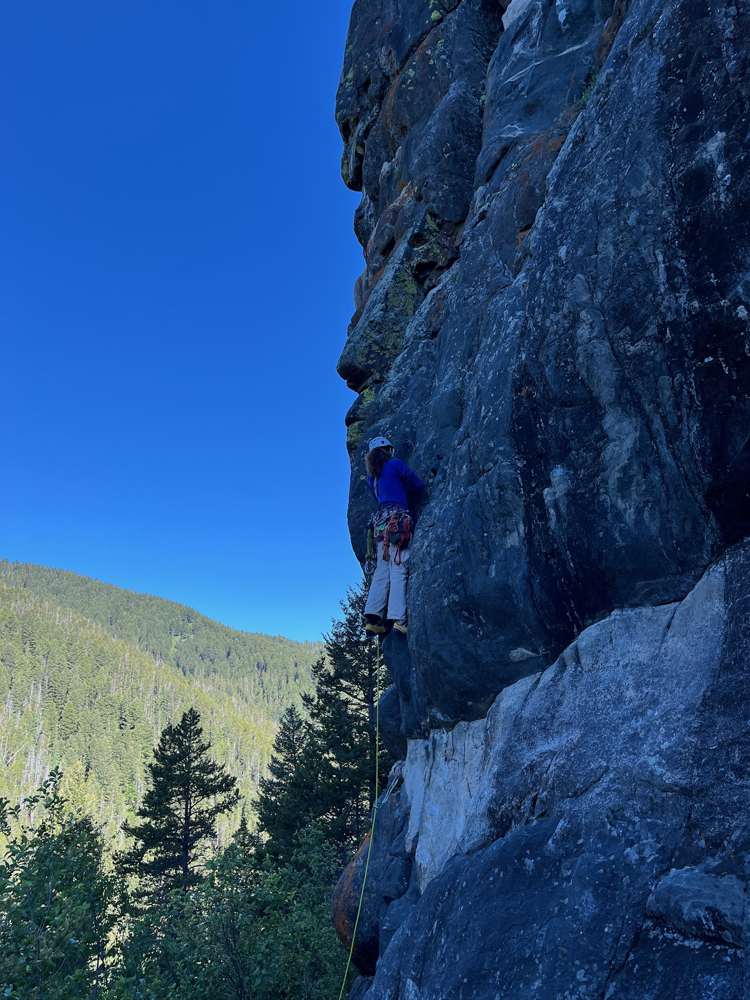
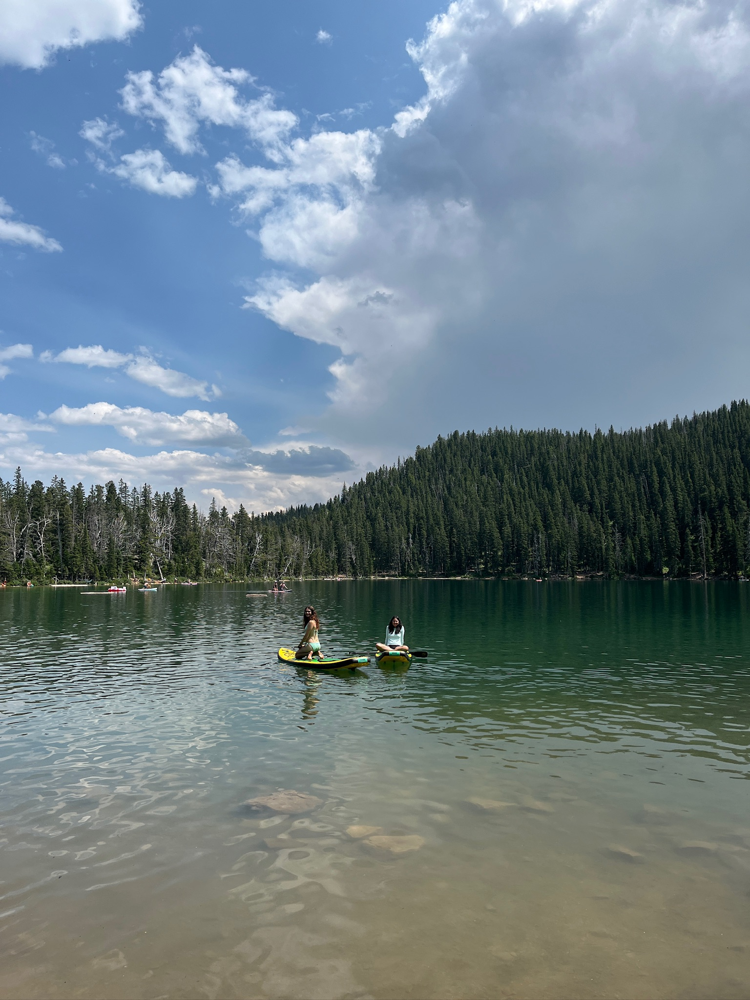
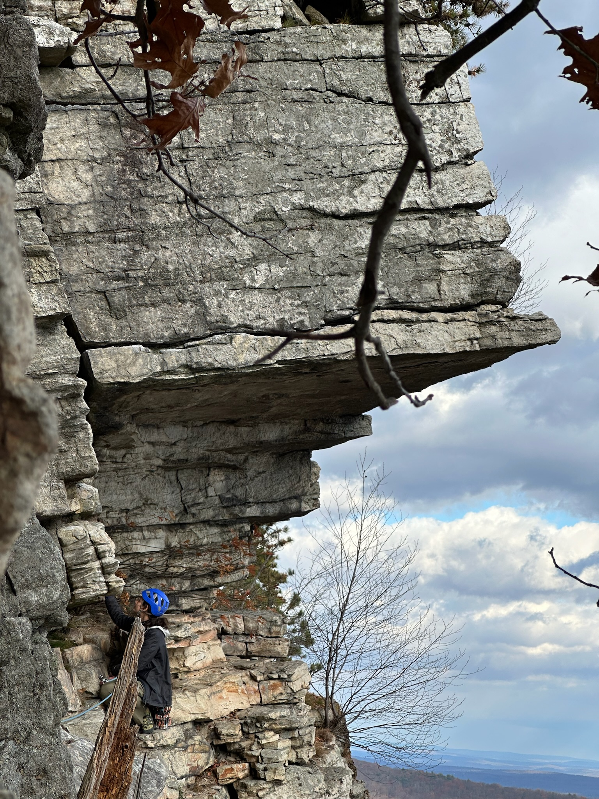
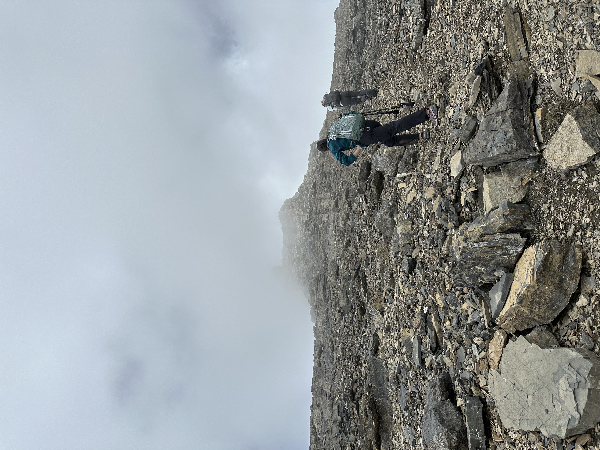
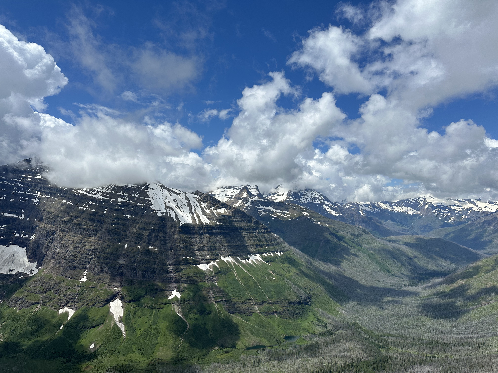
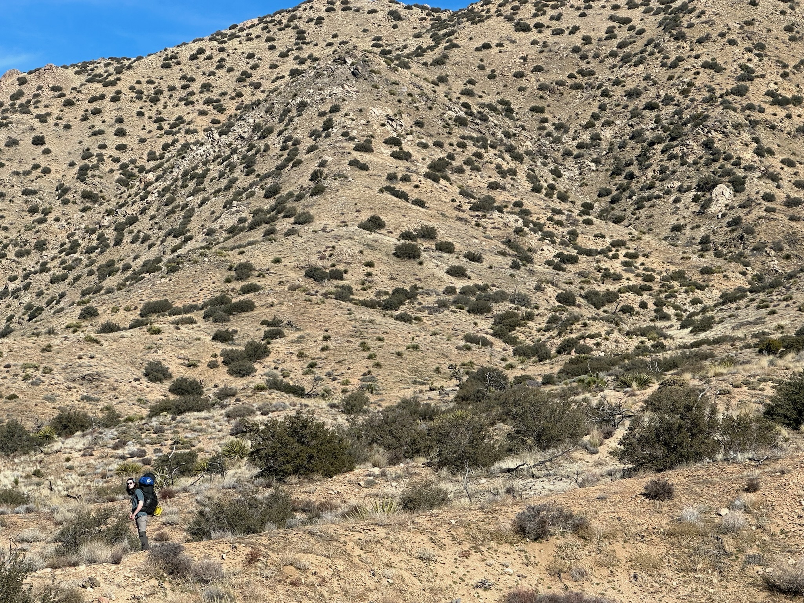

# I love going outside!!

Owen Spalding route of the Grand Teton. 

Views from the summit of the Grand! In Teton National Park.

Trad climbing in Southwestern Montana with my REU buddies!

Stand up (sit down) paddle boarding in Fairy Lake, MT

Climbing in the beautiful, illustrious Gunks. 

Rappelling off the GT ledge of the Gunks

Views just before the summit of Flinch Peak in Glacier National Park. 

Beautiful views on Dawson Pitamankan Loop in Glacier National Park. 

Fun pile of rocks in Joshua Tree National Park.

California Hiking and Riding Trail, Joshua Tree National Park. 

