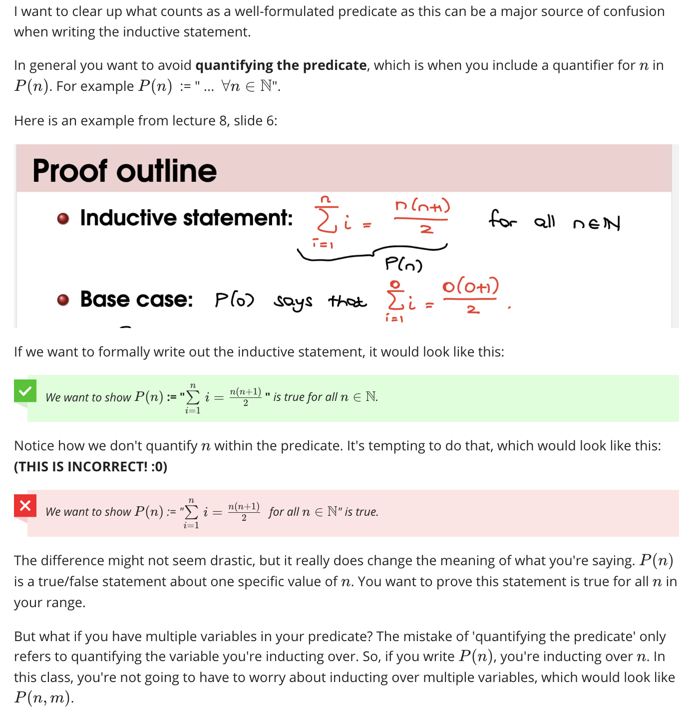
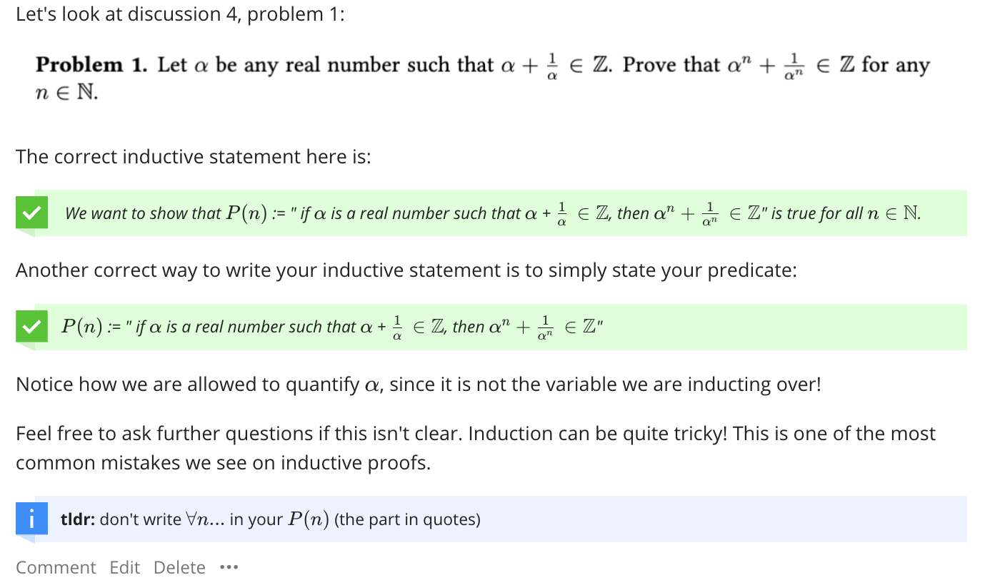
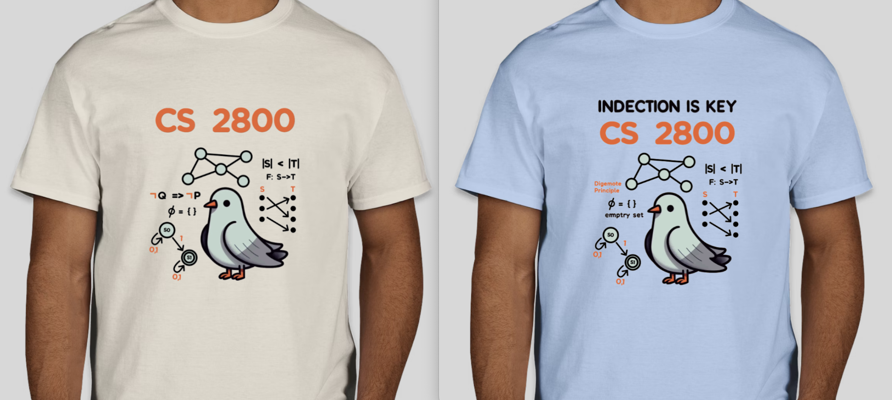
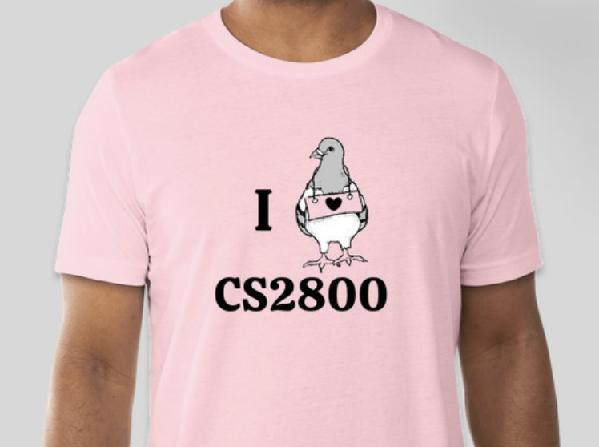

## CS2800 Resources

My favorite job I've ever had is being a TA for CS2800, which I was lucky enough to do for three semesters. Formally known as 'Discrete Structures', now aptly called 'Mathematical Foundation of Computing', this class covers most of the important math you need to get by as a computer scientist. 

During my time as a TA, I spent (likely an excessive) amount of time putting together supplemental study resources. Here you can find links to review sessions, online discussions, and various other things I produced as a TA. 

# Spring '24 Prelim 1 Review Session
Propositional Logic, Induction(strong, weak, graph), Bijectivities, and Binary Relations. 

  <iframe src="https://www.youtube.com/embed/RqS688ovM18" frameborder="0" style="position: absolute; top: 0; left: 0; width: 100%; height: 100%;" allowfullscreen></iframe>

[Click to Download These Slides (Answers Included)](files/Sp24CS2800_Prelim_1_Review_Session.pdf)

[Click to Download These Slides (No Answers)](files/NoSol_Sp24_CS_2800_Prelim_1_Review_Session.pdf)

# Spring '24 Prelim 2 Review Session
 Languages & Automata, Combinatorics, Probability, 

  <iframe src="https://www.youtube.com/embed/CdlwtsTsshw" frameborder="0" style="position: absolute; top: 0; left: 0; width: 100%; height: 100%;" allowfullscreen></iframe>

[Click to Download These Slides (Combinatorics + Probability)](files/Sp24CS2800_Prelim2_Review_Slides.pdf)

# Combinatorics Discussion 

  <iframe src="https://www.youtube.com/embed/6Xe1gOgcmqY" frameborder="0" style="position: absolute; top: 0; left: 0; width: 100%; height: 100%;" allowfullscreen></iframe>

[Click to Download Blank Discussion](files/disc11.pdf)

# Combinatorial Proof 

  <iframe src="https://www.youtube.com/embed/llyjNWYc9mI" frameborder="0" style="position: absolute; top: 0; left: 0; width: 100%; height: 100%;" allowfullscreen></iframe>

# How to Write P(n)

# Class Shirts I Designed! 
I am not a graphic designer but i just loved this class

