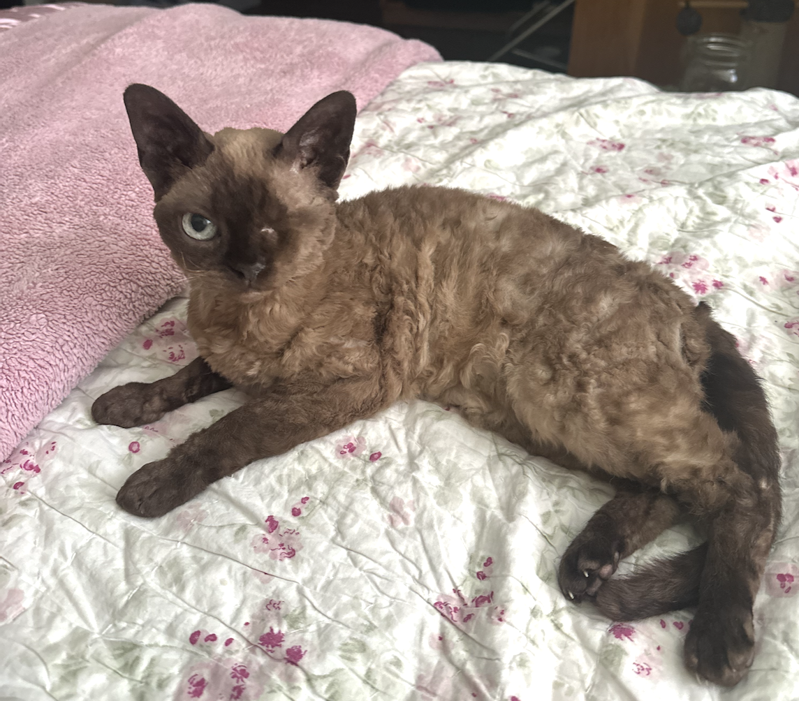

<!-- # About Me -->
Hello! My name is Robyn. I just graduated from Cornell University with a B.A. in mathematics and computer science. This fall, I am excited to continue at Cornell pursuing an <a href="[url](https://www.cs.cornell.edu/ms)">M.S. in computer science</a>!

Thank you for visiting my website. I hope you have fun clicking on the various things to click on!

# Things to Click On!
* [TA Resources - CS2800](cs2800/cs2800.md)
* [Academic Writing](AcademicWriting/writing.md)
* [Nature](Nature/nature.md)

# Panini
Here is a photo of my cat, Panini:

