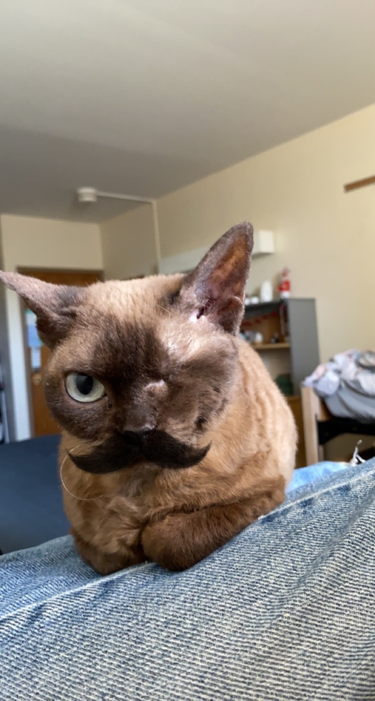

# About Me

Hello! My name is Robyn. I am a rising senior at Cornell University, studying CS and math.

I am currently enjoying an REU at Montana State University, where my work involves computational biology, high-performance computing, and integer linear programming. I love creating intricate algorithms to solve hard problems. 

# Things to Click On!
[CS 2800 Section](cs2800.md)

# Panini
Here is a photo of my cat, Panini:
